# Projects and dependencies analysis

This document provides a comprehensive overview of the projects and their dependencies in the context of upgrading to .NETCoreApp,Version=v10.0.

## Table of Contents

- [Executive Summary](#executive-Summary)
  - [Highlevel Metrics](#highlevel-metrics)
  - [Projects Compatibility](#projects-compatibility)
  - [Package Compatibility](#package-compatibility)
  - [API Compatibility](#api-compatibility)
- [Aggregate NuGet packages details](#aggregate-nuget-packages-details)
- [Top API Migration Challenges](#top-api-migration-challenges)
  - [Technologies and Features](#technologies-and-features)
  - [Most Frequent API Issues](#most-frequent-api-issues)
- [Projects Relationship Graph](#projects-relationship-graph)
- [Project Details](#project-details)

  - [AKSoftware.Localization.MultiLanguages.Benchmarks\AKSoftware.Localization.MultiLanguages.Benchmarks.csproj](#aksoftwarelocalizationmultilanguagesbenchmarksaksoftwarelocalizationmultilanguagesbenchmarkscsproj)
  - [AKSoftware.Localization.MultiLanguages.Blazor\AKSoftware.Localization.MultiLanguages.Blazor.csproj](#aksoftwarelocalizationmultilanguagesblazoraksoftwarelocalizationmultilanguagesblazorcsproj)
  - [AKSoftware.Localization.MultiLanguages.SourceGenerator\AKSoftware.Localization.MultiLanguages.SourceGenerator.csproj](#aksoftwarelocalizationmultilanguagessourcegeneratoraksoftwarelocalizationmultilanguagessourcegeneratorcsproj)
  - [AKSoftware.Localization.MultiLanguages.Tests\AKSoftware.Localization.MultiLanguages.Tests.csproj](#aksoftwarelocalizationmultilanguagestestsaksoftwarelocalizationmultilanguagestestscsproj)
  - [AKSoftware.Localization.MultiLanguages.UWP\AKSoftware.Localization.MultiLanguages.UWP.csproj](#aksoftwarelocalizationmultilanguagesuwpaksoftwarelocalizationmultilanguagesuwpcsproj)
  - [AKSoftware.Localization.MultiLanguages.WinUI\AKSoftware.Localization.MultiLanguages.WinUI.csproj](#aksoftwarelocalizationmultilanguageswinuiaksoftwarelocalizationmultilanguageswinuicsproj)
  - [AKSoftware.Localization.MultiLanguages\AKSoftware.Localization.MultiLanguages.csproj](#aksoftwarelocalizationmultilanguagesaksoftwarelocalizationmultilanguagescsproj)
  - [BlazorAKLocalization\BlazorAKLocalization.csproj](#blazoraklocalizationblazoraklocalizationcsproj)
  - [BlazorServerLocalizationSample\BlazorServerLocalizationSample.csproj](#blazorserverlocalizationsampleblazorserverlocalizationsamplecsproj)
  - [BlazorWebApp.Sample\BlazorWebApp.Sample.csproj](#blazorwebappsampleblazorwebappsamplecsproj)
  - [ConsoleAppSample\ConsoleAppSample.csproj](#consoleappsampleconsoleappsamplecsproj)
  - [D:\dev\GitHub\multilanguages\tests\AKSoftware.Localization.MultiLanguages.UWP.Tests\AKSoftware.Localization.MultiLanguages.UWP.Tests.csproj](#d:devgithubmultilanguagestestsaksoftwarelocalizationmultilanguagesuwptestsaksoftwarelocalizationmultilanguagesuwptestscsproj)
  - [UwpAkLocalization\UwpAkLocalization.csproj](#uwpaklocalizationuwpaklocalizationcsproj)
  - [WinUIAkLocalization\WinUIAkLocalization.csproj](#winuiaklocalizationwinuiaklocalizationcsproj)

## Executive Summary

### Highlevel Metrics

| Metric | Count | Status |
| :--- | :---: | :--- |
| Total Projects | 14 | All require upgrade |
| Total NuGet Packages | 31 | 10 need upgrade |
| Total Code Files | 94 |  |
| Total Code Files with Incidents | 21 |  |
| Total Lines of Code | 7494 |  |
| Total Number of Issues | 49 |  |
| Estimated LOC to modify | 13+ | at least 0.2% of codebase |

### Projects Compatibility

| Project | Target Framework | Difficulty | Package Issues | API Issues | Est. LOC Impact | Description |
| :--- | :---: | :---: | :---: | :---: | :---: | :--- |
| [AKSoftware.Localization.MultiLanguages.Benchmarks\AKSoftware.Localization.MultiLanguages.Benchmarks.csproj](#aksoftwarelocalizationmultilanguagesbenchmarksaksoftwarelocalizationmultilanguagesbenchmarkscsproj) | net6.0;net10.0 | 🟢 Low | 0 | 0 |  | DotNetCoreApp, Sdk Style = True |
| [AKSoftware.Localization.MultiLanguages.Blazor\AKSoftware.Localization.MultiLanguages.Blazor.csproj](#aksoftwarelocalizationmultilanguagesblazoraksoftwarelocalizationmultilanguagesblazorcsproj) | net8.0;net9.0;net10.0 | 🟢 Low | 1 | 0 |  | ClassLibrary, Sdk Style = True |
| [AKSoftware.Localization.MultiLanguages.SourceGenerator\AKSoftware.Localization.MultiLanguages.SourceGenerator.csproj](#aksoftwarelocalizationmultilanguagessourcegeneratoraksoftwarelocalizationmultilanguagessourcegeneratorcsproj) | netstandard2.0;net10.0 | 🟢 Low | 1 | 0 |  | ClassLibrary, Sdk Style = True |
| [AKSoftware.Localization.MultiLanguages.Tests\AKSoftware.Localization.MultiLanguages.Tests.csproj](#aksoftwarelocalizationmultilanguagestestsaksoftwarelocalizationmultilanguagestestscsproj) | net8.0;net10.0 | 🟢 Low | 1 | 0 |  | DotNetCoreApp, Sdk Style = True |
| [AKSoftware.Localization.MultiLanguages.UWP\AKSoftware.Localization.MultiLanguages.UWP.csproj](#aksoftwarelocalizationmultilanguagesuwpaksoftwarelocalizationmultilanguagesuwpcsproj) | net5.0 | 🟢 Low | 3 | 0 |  | Uwp, Sdk Style = False |
| [AKSoftware.Localization.MultiLanguages.WinUI\AKSoftware.Localization.MultiLanguages.WinUI.csproj](#aksoftwarelocalizationmultilanguageswinuiaksoftwarelocalizationmultilanguageswinuicsproj) | net8.0-windows10.0.19041.0;net10.0-windows10.0.19041.0 | 🟢 Low | 1 | 0 |  | WinUI, Sdk Style = True |
| [AKSoftware.Localization.MultiLanguages\AKSoftware.Localization.MultiLanguages.csproj](#aksoftwarelocalizationmultilanguagesaksoftwarelocalizationmultilanguagescsproj) | netstandard2.0;net8.0;net9.0;net10.0 | 🟢 Low | 3 | 0 |  | ClassLibrary, Sdk Style = True |
| [BlazorAKLocalization\BlazorAKLocalization.csproj](#blazoraklocalizationblazoraklocalizationcsproj) | net8.0;net10.0 | 🟢 Low | 4 | 3 | 3+ | AspNetCore, Sdk Style = True |
| [BlazorServerLocalizationSample\BlazorServerLocalizationSample.csproj](#blazorserverlocalizationsampleblazorserverlocalizationsamplecsproj) | net8.0;net10.0 | 🟢 Low | 0 | 1 | 1+ | AspNetCore, Sdk Style = True |
| [BlazorWebApp.Sample\BlazorWebApp.Sample.csproj](#blazorwebappsampleblazorwebappsamplecsproj) | net9.0;net10.0 | 🟢 Low | 0 | 1 | 1+ | AspNetCore, Sdk Style = True |
| [ConsoleAppSample\ConsoleAppSample.csproj](#consoleappsampleconsoleappsamplecsproj) | net7.0;net10.0 | 🟢 Low | 0 | 0 |  | DotNetCoreApp, Sdk Style = True |
| [D:\dev\GitHub\multilanguages\tests\AKSoftware.Localization.MultiLanguages.UWP.Tests\AKSoftware.Localization.MultiLanguages.UWP.Tests.csproj](#d:devgithubmultilanguagestestsaksoftwarelocalizationmultilanguagesuwptestsaksoftwarelocalizationmultilanguagesuwptestscsproj) | net5.0 | 🟢 Low | 1 | 0 |  | Uwp, Sdk Style = False |
| [UwpAkLocalization\UwpAkLocalization.csproj](#uwpaklocalizationuwpaklocalizationcsproj) | net5.0 | 🟢 Low | 2 | 2 | 2+ | Uwp, Sdk Style = False |
| [WinUIAkLocalization\WinUIAkLocalization.csproj](#winuiaklocalizationwinuiaklocalizationcsproj) | net8.0-windows10.0.19041.0;net10.0-windows10.0.19041.0 | 🟢 Low | 2 | 6 | 6+ | WinForms, Sdk Style = True |

### Package Compatibility

| Status | Count | Percentage |
| :--- | :---: | :---: |
| ✅ Compatible | 21 | 67.7% |
| ⚠️ Incompatible | 3 | 9.7% |
| 🔄 Upgrade Recommended | 7 | 22.6% |
| ***Total NuGet Packages*** | ***31*** | ***100%*** |

### API Compatibility

| Category | Count | Impact |
| :--- | :---: | :--- |
| 🔴 Binary Incompatible | 0 | High - Require code changes |
| 🟡 Source Incompatible | 0 | Medium - Needs re-compilation and potential conflicting API error fixing |
| 🔵 Behavioral change | 13 | Low - Behavioral changes that may require testing at runtime |
| ✅ Compatible | 10864 |  |
| ***Total APIs Analyzed*** | ***10877*** |  |

## Aggregate NuGet packages details

| Package | Current Version | Suggested Version | Projects | Description |
| :--- | :---: | :---: | :--- | :--- |
| AKSoftware.Localization.MultiLanguages | 5.8.0 |  | [AKSoftware.Localization.MultiLanguages.Benchmarks.csproj](#aksoftwarelocalizationmultilanguagesbenchmarksaksoftwarelocalizationmultilanguagesbenchmarkscsproj) | ✅Compatible |
| AKSoftware.Localization.MultiLanguages.Blazor | 6.0.0-alpha |  | [BlazorWebApp.Sample.csproj](#blazorwebappsampleblazorwebappsamplecsproj) | ✅Compatible |
| AKSoftware.Localization.MultiLanguages.SourceGenerator | 6.0.0-alpha |  | [BlazorWebApp.Sample.csproj](#blazorwebappsampleblazorwebappsamplecsproj) | ✅Compatible |
| BenchmarkDotNet | 0.13.2 |  | [AKSoftware.Localization.MultiLanguages.Benchmarks.csproj](#aksoftwarelocalizationmultilanguagesbenchmarksaksoftwarelocalizationmultilanguagesbenchmarkscsproj) [BlazorServerLocalizationSample.csproj](#blazorserverlocalizationsampleblazorserverlocalizationsamplecsproj) | ✅Compatible |
| BenchmarkDotNet.Annotations | 0.13.2 |  | [AKSoftware.Localization.MultiLanguages.Benchmarks.csproj](#aksoftwarelocalizationmultilanguagesbenchmarksaksoftwarelocalizationmultilanguagesbenchmarkscsproj) | ✅Compatible |
| Blazored.LocalStorage | 3.0.0 |  | [BlazorAKLocalization.csproj](#blazoraklocalizationblazoraklocalizationcsproj) | ✅Compatible |
| coverlet.collector | 3.1.2 |  | [AKSoftware.Localization.MultiLanguages.Tests.csproj](#aksoftwarelocalizationmultilanguagestestsaksoftwarelocalizationmultilanguagestestscsproj) | ✅Compatible |
| fluentassertions | 6.12.1 |  | [AKSoftware.Localization.MultiLanguages.Tests.csproj](#aksoftwarelocalizationmultilanguagestestsaksoftwarelocalizationmultilanguagestestscsproj) | ✅Compatible |
| Microsoft.AspNetCore.Components.Forms | 3.1.32 | 10.0.7 | [AKSoftware.Localization.MultiLanguages.csproj](#aksoftwarelocalizationmultilanguagesaksoftwarelocalizationmultilanguagescsproj) | NuGet package upgrade is recommended |
| Microsoft.AspNetCore.Components.Web | 8.0.0 | 10.0.7 | [AKSoftware.Localization.MultiLanguages.Blazor.csproj](#aksoftwarelocalizationmultilanguagesblazoraksoftwarelocalizationmultilanguagesblazorcsproj) | NuGet package upgrade is recommended |
| Microsoft.AspNetCore.Components.WebAssembly | 8.0.0 | 10.0.7 | [BlazorAKLocalization.csproj](#blazoraklocalizationblazoraklocalizationcsproj) | NuGet package upgrade is recommended |
| Microsoft.AspNetCore.Components.WebAssembly.DevServer | 8.0.0 | 10.0.7 | [BlazorAKLocalization.csproj](#blazoraklocalizationblazoraklocalizationcsproj) | NuGet package upgrade is recommended |
| Microsoft.CodeAnalysis.Analyzers | 3.11.0 |  | [AKSoftware.Localization.MultiLanguages.SourceGenerator.csproj](#aksoftwarelocalizationmultilanguagessourcegeneratoraksoftwarelocalizationmultilanguagessourcegeneratorcsproj) | ✅Compatible |
| Microsoft.CodeAnalysis.CSharp | 4.10.0 |  | [AKSoftware.Localization.MultiLanguages.SourceGenerator.csproj](#aksoftwarelocalizationmultilanguagessourcegeneratoraksoftwarelocalizationmultilanguagessourcegeneratorcsproj) | ✅Compatible |
| Microsoft.csharp | 4.7.0 |  | [AKSoftware.Localization.MultiLanguages.csproj](#aksoftwarelocalizationmultilanguagesaksoftwarelocalizationmultilanguagescsproj) | ✅Compatible |
| Microsoft.Extensions.DependencyInjection | 8.0.0 | 10.0.7 | [AKSoftware.Localization.MultiLanguages.UWP.csproj](#aksoftwarelocalizationmultilanguagesuwpaksoftwarelocalizationmultilanguagesuwpcsproj) [UwpAkLocalization.csproj](#uwpaklocalizationuwpaklocalizationcsproj) [WinUIAkLocalization.csproj](#winuiaklocalizationwinuiaklocalizationcsproj) | NuGet package upgrade is recommended |
| Microsoft.Extensions.DependencyInjection.Abstractions | 8.0.0 | 10.0.7 | [AKSoftware.Localization.MultiLanguages.csproj](#aksoftwarelocalizationmultilanguagesaksoftwarelocalizationmultilanguagescsproj) [AKSoftware.Localization.MultiLanguages.SourceGenerator.csproj](#aksoftwarelocalizationmultilanguagessourcegeneratoraksoftwarelocalizationmultilanguagessourcegeneratorcsproj) | NuGet package upgrade is recommended |
| Microsoft.NET.Test.Sdk | 16.11.0 |  | [AKSoftware.Localization.MultiLanguages.UWP.Tests.csproj](#d:devgithubmultilanguagestestsaksoftwarelocalizationmultilanguagesuwptestsaksoftwarelocalizationmultilanguagesuwptestscsproj) | ✅Compatible |
| Microsoft.NET.Test.Sdk | 17.3.2 |  | [AKSoftware.Localization.MultiLanguages.Tests.csproj](#aksoftwarelocalizationmultilanguagestestsaksoftwarelocalizationmultilanguagestestscsproj) | ✅Compatible |
| Microsoft.NETCore.UniversalWindowsPlatform | 6.2.10 |  | [AKSoftware.Localization.MultiLanguages.UWP.csproj](#aksoftwarelocalizationmultilanguagesuwpaksoftwarelocalizationmultilanguagesuwpcsproj) [AKSoftware.Localization.MultiLanguages.UWP.Tests.csproj](#d:devgithubmultilanguagestestsaksoftwarelocalizationmultilanguagesuwptestsaksoftwarelocalizationmultilanguagesuwptestscsproj) [UwpAkLocalization.csproj](#uwpaklocalizationuwpaklocalizationcsproj) | Needs to be replaced with Replace with new package Microsoft.WindowsAppSDK=2.0.1;Microsoft.Graphics.Win2D=1.1.0;Microsoft.Windows.Compatibility=10.0.7 |
| Microsoft.WindowsAppSDK | 2.0.1 |  | [AKSoftware.Localization.MultiLanguages.WinUI.csproj](#aksoftwarelocalizationmultilanguageswinuiaksoftwarelocalizationmultilanguageswinuicsproj) [WinUIAkLocalization.csproj](#winuiaklocalizationwinuiaklocalizationcsproj) | ✅Compatible |
| Microsoft.Xaml.Behaviors.Uwp.Managed | 2.0.1 |  | [AKSoftware.Localization.MultiLanguages.UWP.csproj](#aksoftwarelocalizationmultilanguagesuwpaksoftwarelocalizationmultilanguagesuwpcsproj) | ⚠️NuGet package is incompatible |
| Microsoft.Xaml.Behaviors.WinUI.Managed | 2.0.9 |  | [AKSoftware.Localization.MultiLanguages.WinUI.csproj](#aksoftwarelocalizationmultilanguageswinuiaksoftwarelocalizationmultilanguageswinuicsproj) [WinUIAkLocalization.csproj](#winuiaklocalizationwinuiaklocalizationcsproj) | ⚠️NuGet package is incompatible |
| MSTest.TestAdapter | 2.0.0 |  | [AKSoftware.Localization.MultiLanguages.UWP.Tests.csproj](#d:devgithubmultilanguagestestsaksoftwarelocalizationmultilanguagesuwptestsaksoftwarelocalizationmultilanguagesuwptestscsproj) | ✅Compatible |
| MSTest.TestFramework | 2.0.0 |  | [AKSoftware.Localization.MultiLanguages.UWP.Tests.csproj](#d:devgithubmultilanguagestestsaksoftwarelocalizationmultilanguagesuwptestsaksoftwarelocalizationmultilanguagesuwptestscsproj) | ✅Compatible |
| NETStandard.Library | 2.0.3 |  | [AKSoftware.Localization.MultiLanguages.csproj](#aksoftwarelocalizationmultilanguagesaksoftwarelocalizationmultilanguagescsproj) [AKSoftware.Localization.MultiLanguages.SourceGenerator.csproj](#aksoftwarelocalizationmultilanguagessourcegeneratoraksoftwarelocalizationmultilanguagessourcegeneratorcsproj) | ✅Compatible |
| System.ComponentModel.Annotations | 5.0.0 |  | [AKSoftware.Localization.MultiLanguages.csproj](#aksoftwarelocalizationmultilanguagesaksoftwarelocalizationmultilanguagescsproj) | NuGet package functionality is included with framework reference |
| System.Net.Http.Json | 5.0.0 | 10.0.7 | [BlazorAKLocalization.csproj](#blazoraklocalizationblazoraklocalizationcsproj) | NuGet package upgrade is recommended |
| xunit | 2.4.2 |  | [AKSoftware.Localization.MultiLanguages.Tests.csproj](#aksoftwarelocalizationmultilanguagestestsaksoftwarelocalizationmultilanguagestestscsproj) | ⚠️NuGet package is deprecated |
| xunit.runner.visualstudio | 2.4.5 |  | [AKSoftware.Localization.MultiLanguages.Tests.csproj](#aksoftwarelocalizationmultilanguagestestsaksoftwarelocalizationmultilanguagestestscsproj) | ✅Compatible |
| YamlDotNet | 9.1.0 |  | [AKSoftware.Localization.MultiLanguages.csproj](#aksoftwarelocalizationmultilanguagesaksoftwarelocalizationmultilanguagescsproj) [AKSoftware.Localization.MultiLanguages.SourceGenerator.csproj](#aksoftwarelocalizationmultilanguagessourcegeneratoraksoftwarelocalizationmultilanguagessourcegeneratorcsproj) | ✅Compatible |

## In-solution Package vs Project Reference Findings

The assessment found inconsistent dependency style for local AKSoftware projects in sample/benchmark apps.

### Observed inconsistencies

1. **Benchmarks project has duplicate dependency style for the same library**
   - File: `src/AKSoftware.Localization.MultiLanguages.Benchmarks/AKSoftware.Localization.MultiLanguages.Benchmarks.csproj`
   - Current state:
     - `PackageReference Include="AKSoftware.Localization.MultiLanguages" Version="5.8.0"`
     - `ProjectReference Include="..\AKSoftware.Localization.MultiLanguages\AKSoftware.Localization.MultiLanguages.csproj"`
   - Impact: same logical dependency is represented both as NuGet and project reference.

2. **Blazor Web App sample consumes in-repo libraries via NuGet packages instead of solution projects**
   - File: `src/BlazorWebApp.Sample/BlazorWebApp.Sample.csproj`
   - Current state:
     - `PackageReference Include="AKSoftware.Localization.MultiLanguages.Blazor" Version="6.0.0-alpha"`
     - `PackageReference Include="AKSoftware.Localization.MultiLanguages.SourceGenerator" Version="6.0.0-alpha"`
   - Impact: sample app dependency resolution can diverge from local source projects during branch-based development.

### Baseline consistency examples already using project references

- `src/BlazorAKLocalization/BlazorAKLocalization.csproj`
  - references `AKSoftware.Localization.MultiLanguages.Blazor` and `AKSoftware.Localization.MultiLanguages` via `ProjectReference`.
- `src/BlazorServerLocalizationSample/BlazorServerLocalizationSample.csproj`
  - references `AKSoftware.Localization.MultiLanguages.Blazor` via `ProjectReference`.

### Relevance to this scenario

This affects dependency consistency during the non-UWP multi-target upgrade validation, because migration/test results may differ depending on whether local source projects or published package versions are consumed.

## User-requested migration constraints (to carry into planning)

The user requested the following scope constraints for this scenario:

1. **Application projects should be single-targeted to .NET 10 only**
   - Blazor app projects and WinUI app projects should use `TargetFramework` with `.NET 10` only (no multi-targeting for app projects).

2. **Library projects should remain multi-targeted and include .NET 10**
   - Libraries consumed by the apps should continue using `TargetFrameworks` and include `.NET 10` as one of the targets.

3. **UWP projects remain out of scope for this upgrade**
   - Existing UWP projects are excluded from this non-UWP modernization pass.

4. **Assessment-first tracking requirement**
   - Until transition to Planning, user-requested changes are to be documented in this assessment.

## Top API Migration Challenges

### Technologies and Features

| Technology | Issues | Percentage | Migration Path |
| :--- | :---: | :---: | :--- |

### Most Frequent API Issues

| API | Count | Percentage | Category |
| :--- | :---: | :---: | :--- |
| T:System.Uri | 6 | 46.2% | Behavioral Change |
| M:System.Uri.#ctor(System.String) | 5 | 38.5% | Behavioral Change |
| M:Microsoft.AspNetCore.Builder.ExceptionHandlerExtensions.UseExceptionHandler(Microsoft.AspNetCore.Builder.IApplicationBuilder,System.String) | 1 | 7.7% | Behavioral Change |
| M:Microsoft.AspNetCore.Builder.ExceptionHandlerExtensions.UseExceptionHandler(Microsoft.AspNetCore.Builder.IApplicationBuilder,System.String,System.Boolean) | 1 | 7.7% | Behavioral Change |

## Projects Relationship Graph

Legend:
📦 SDK-style project
⚙️ Classic project

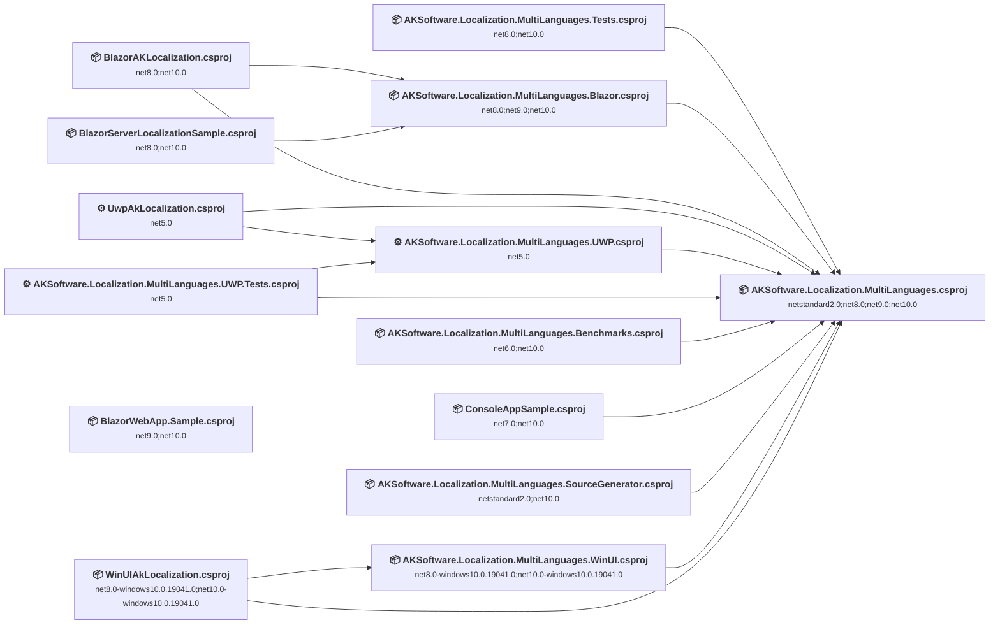

## Project Details

### AKSoftware.Localization.MultiLanguages.Benchmarks\AKSoftware.Localization.MultiLanguages.Benchmarks.csproj

#### Project Info

- **Current Target Framework:** net6.0;net10.0
- **Proposed Target Framework:** net6.0;net10.0;net10.0
- **SDK-style**: True
- **Project Kind:** DotNetCoreApp
- **Dependencies**: 1
- **Dependants**: 0
- **Number of Files**: 11
- **Number of Files with Incidents**: 1
- **Lines of Code**: 35
- **Estimated LOC to modify**: 0+ (at least 0.0% of the project)

#### Dependency Graph

Legend:
📦 SDK-style project
⚙️ Classic project

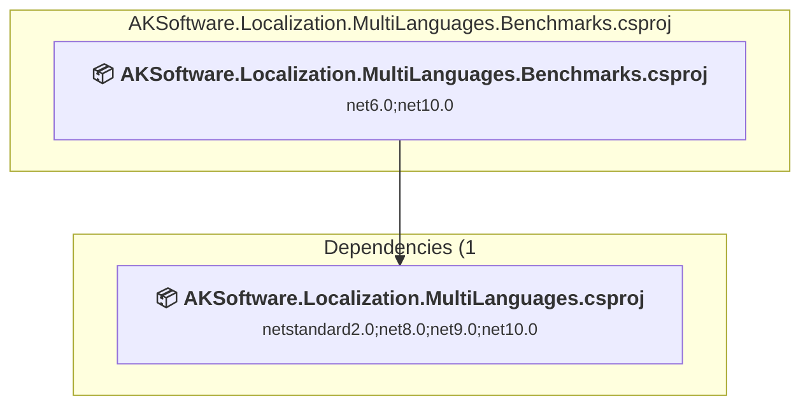

### API Compatibility

| Category | Count | Impact |
| :--- | :---: | :--- |
| 🔴 Binary Incompatible | 0 | High - Require code changes |
| 🟡 Source Incompatible | 0 | Medium - Needs re-compilation and potential conflicting API error fixing |
| 🔵 Behavioral change | 0 | Low - Behavioral changes that may require testing at runtime |
| ✅ Compatible | 43 |  |
| ***Total APIs Analyzed*** | ***43*** |  |

### AKSoftware.Localization.MultiLanguages.Blazor\AKSoftware.Localization.MultiLanguages.Blazor.csproj

#### Project Info

- **Current Target Framework:** net8.0;net9.0;net10.0
- **Proposed Target Framework:** net8.0;net9.0;net10.0;net10.0
- **SDK-style**: True
- **Project Kind:** ClassLibrary
- **Dependencies**: 1
- **Dependants**: 2
- **Number of Files**: 3
- **Number of Files with Incidents**: 1
- **Lines of Code**: 68
- **Estimated LOC to modify**: 0+ (at least 0.0% of the project)

#### Dependency Graph

Legend:
📦 SDK-style project
⚙️ Classic project

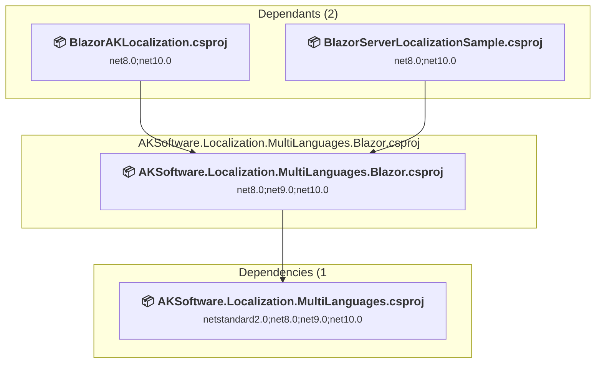

### API Compatibility

| Category | Count | Impact |
| :--- | :---: | :--- |
| 🔴 Binary Incompatible | 0 | High - Require code changes |
| 🟡 Source Incompatible | 0 | Medium - Needs re-compilation and potential conflicting API error fixing |
| 🔵 Behavioral change | 0 | Low - Behavioral changes that may require testing at runtime |
| ✅ Compatible | 38 |  |
| ***Total APIs Analyzed*** | ***38*** |  |

### AKSoftware.Localization.MultiLanguages.SourceGenerator\AKSoftware.Localization.MultiLanguages.SourceGenerator.csproj

#### Project Info

- **Current Target Framework:** netstandard2.0;net10.0
- **Proposed Target Framework:** netstandard2.0;net10.0;net10.0
- **SDK-style**: True
- **Project Kind:** ClassLibrary
- **Dependencies**: 1
- **Dependants**: 0
- **Number of Files**: 4
- **Number of Files with Incidents**: 1
- **Lines of Code**: 121
- **Estimated LOC to modify**: 0+ (at least 0.0% of the project)

#### Dependency Graph

Legend:
📦 SDK-style project
⚙️ Classic project

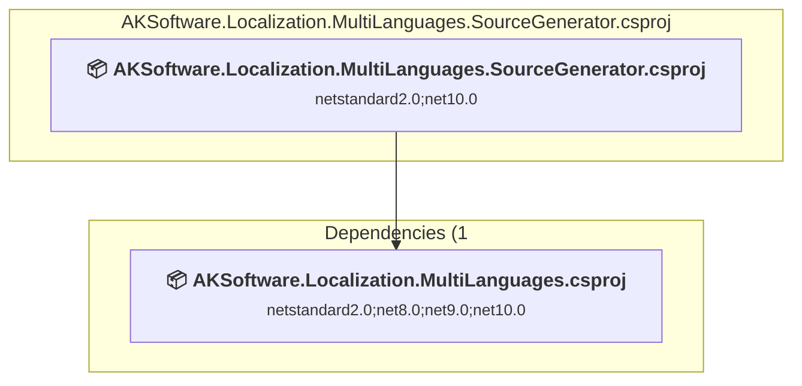

### API Compatibility

| Category | Count | Impact |
| :--- | :---: | :--- |
| 🔴 Binary Incompatible | 0 | High - Require code changes |
| 🟡 Source Incompatible | 0 | Medium - Needs re-compilation and potential conflicting API error fixing |
| 🔵 Behavioral change | 0 | Low - Behavioral changes that may require testing at runtime |
| ✅ Compatible | 58 |  |
| ***Total APIs Analyzed*** | ***58*** |  |

### AKSoftware.Localization.MultiLanguages.Tests\AKSoftware.Localization.MultiLanguages.Tests.csproj

#### Project Info

- **Current Target Framework:** net8.0;net10.0
- **Proposed Target Framework:** net8.0;net10.0;net10.0
- **SDK-style**: True
- **Project Kind:** DotNetCoreApp
- **Dependencies**: 1
- **Dependants**: 0
- **Number of Files**: 34
- **Number of Files with Incidents**: 1
- **Lines of Code**: 1036
- **Estimated LOC to modify**: 0+ (at least 0.0% of the project)

#### Dependency Graph

Legend:
📦 SDK-style project
⚙️ Classic project

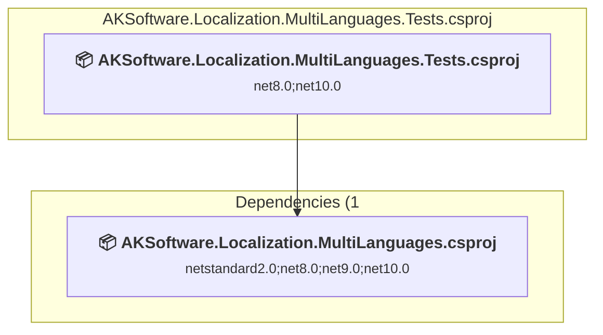

### API Compatibility

| Category | Count | Impact |
| :--- | :---: | :--- |
| 🔴 Binary Incompatible | 0 | High - Require code changes |
| 🟡 Source Incompatible | 0 | Medium - Needs re-compilation and potential conflicting API error fixing |
| 🔵 Behavioral change | 0 | Low - Behavioral changes that may require testing at runtime |
| ✅ Compatible | 894 |  |
| ***Total APIs Analyzed*** | ***894*** |  |

### AKSoftware.Localization.MultiLanguages.UWP\AKSoftware.Localization.MultiLanguages.UWP.csproj

#### Project Info

- **Current Target Framework:** net5.0
- **Proposed Target Framework:** net10.0-windows10.0.22000.0
- **SDK-style**: False
- **Project Kind:** Uwp
- **Dependencies**: 1
- **Dependants**: 2
- **Number of Files**: 13
- **Number of Files with Incidents**: 1
- **Lines of Code**: 852
- **Estimated LOC to modify**: 0+ (at least 0.0% of the project)

#### Dependency Graph

Legend:
📦 SDK-style project
⚙️ Classic project

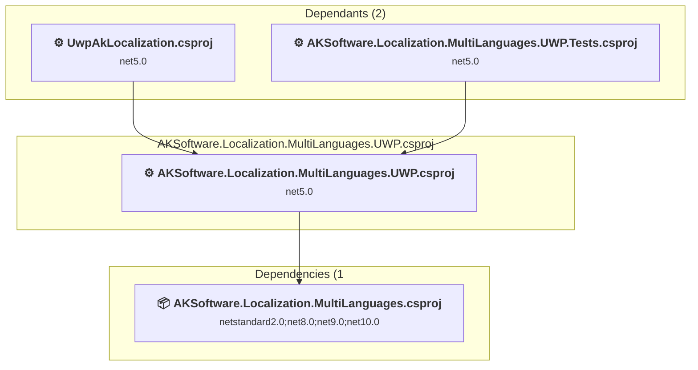

### API Compatibility

| Category | Count | Impact |
| :--- | :---: | :--- |
| 🔴 Binary Incompatible | 0 | High - Require code changes |
| 🟡 Source Incompatible | 0 | Medium - Needs re-compilation and potential conflicting API error fixing |
| 🔵 Behavioral change | 0 | Low - Behavioral changes that may require testing at runtime |
| ✅ Compatible | 560 |  |
| ***Total APIs Analyzed*** | ***560*** |  |

### AKSoftware.Localization.MultiLanguages.WinUI\AKSoftware.Localization.MultiLanguages.WinUI.csproj

#### Project Info

- **Current Target Framework:** net8.0-windows10.0.19041.0;net10.0-windows10.0.19041.0
- **Proposed Target Framework:** net8.0-windows10.0.19041.0;net10.0-windows10.0.19041.0;net10.0-windows10.0.22000.0
- **SDK-style**: True
- **Project Kind:** WinUI
- **Dependencies**: 1
- **Dependants**: 1
- **Number of Files**: 11
- **Number of Files with Incidents**: 1
- **Lines of Code**: 730
- **Estimated LOC to modify**: 0+ (at least 0.0% of the project)

#### Dependency Graph

Legend:
📦 SDK-style project
⚙️ Classic project

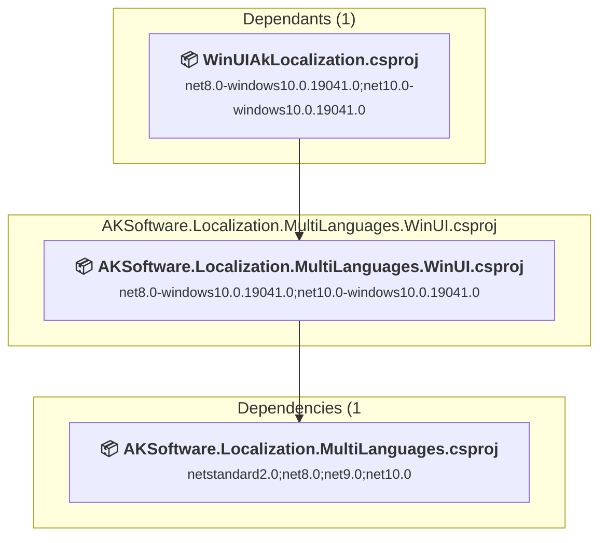

### API Compatibility

| Category | Count | Impact |
| :--- | :---: | :--- |
| 🔴 Binary Incompatible | 0 | High - Require code changes |
| 🟡 Source Incompatible | 0 | Medium - Needs re-compilation and potential conflicting API error fixing |
| 🔵 Behavioral change | 0 | Low - Behavioral changes that may require testing at runtime |
| ✅ Compatible | 595 |  |
| ***Total APIs Analyzed*** | ***595*** |  |

### AKSoftware.Localization.MultiLanguages\AKSoftware.Localization.MultiLanguages.csproj

#### Project Info

- **Current Target Framework:** netstandard2.0;net8.0;net9.0;net10.0
- **Proposed Target Framework:** netstandard2.0;net8.0;net9.0;net10.0;net10.0
- **SDK-style**: True
- **Project Kind:** ClassLibrary
- **Dependencies**: 0
- **Dependants**: 11
- **Number of Files**: 25
- **Number of Files with Incidents**: 1
- **Lines of Code**: 3555
- **Estimated LOC to modify**: 0+ (at least 0.0% of the project)

#### Dependency Graph

Legend:
📦 SDK-style project
⚙️ Classic project

```mermaid
flowchart TB
    subgraph upstream["Dependants (11)"]
        P2["<b>📦&nbsp;AKSoftware.Localization.MultiLanguages.Tests.csproj</b><br/><small>net8.0;net10.0</small>"]
        P3["<b>📦&nbsp;AKSoftware.Localization.MultiLanguages.Blazor.csproj</b><br/><small>net8.0;net9.0;net10.0</small>"]
        P4["<b>📦&nbsp;BlazorAKLocalization.csproj</b><br/><small>net8.0;net10.0</small>"]
        P5["<b>⚙️&nbsp;UwpAkLocalization.csproj</b><br/><small>net5.0</small>"]
        P6["<b>⚙️&nbsp;AKSoftware.Localization.MultiLanguages.UWP.csproj</b><br/><small>net5.0</small>"]
        P7["<b>⚙️&nbsp;AKSoftware.Localization.MultiLanguages.UWP.Tests.csproj</b><br/><small>net5.0</small>"]
        P9["<b>📦&nbsp;AKSoftware.Localization.MultiLanguages.Benchmarks.csproj</b><br/><small>net6.0;net10.0</small>"]
        P10["<b>📦&nbsp;ConsoleAppSample.csproj</b><br/><small>net7.0;net10.0</small>"]
        P11["<b>📦&nbsp;AKSoftware.Localization.MultiLanguages.SourceGenerator.csproj</b><br/><small>netstandard2.0;net10.0</small>"]
        P13["<b>📦&nbsp;AKSoftware.Localization.MultiLanguages.WinUI.csproj</b><br/><small>net8.0-windows10.0.19041.0;net10.0-windows10.0.19041.0</small>"]
        P14["<b>📦&nbsp;WinUIAkLocalization.csproj</b><br/><small>net8.0-windows10.0.19041.0;net10.0-windows10.0.19041.0</small>"]
        click P2 "#aksoftwarelocalizationmultilanguagestestsaksoftwarelocalizationmultilanguagestestscsproj"
        click P3 "#aksoftwarelocalizationmultilanguagesblazoraksoftwarelocalizationmultilanguagesblazorcsproj"
        click P4 "#blazoraklocalizationblazoraklocalizationcsproj"
        click P5 "#uwpaklocalizationuwpaklocalizationcsproj"
        click P6 "#aksoftwarelocalizationmultilanguagesuwpaksoftwarelocalizationmultilanguagesuwpcsproj"
        click P7 "#d:devgithubmultilanguagestestsaksoftwarelocalizationmultilanguagesuwptestsaksoftwarelocalizationmultilanguagesuwptestscsproj"
        click P9 "#aksoftwarelocalizationmultilanguagesbenchmarksaksoftwarelocalizationmultilanguagesbenchmarkscsproj"
        click P10 "#consoleappsampleconsoleappsamplecsproj"
        click P11 "#aksoftwarelocalizationmultilanguagessourcegeneratoraksoftwarelocalizationmultilanguagessourcegeneratorcsproj"
        click P13 "#aksoftwarelocalizationmultilanguageswinuiaksoftwarelocalizationmultilanguageswinuicsproj"
        click P14 "#winuiaklocalizationwinuiaklocalizationcsproj"
    end
    subgraph current["AKSoftware.Localization.MultiLanguages.csproj"]
        MAIN["<b>📦&nbsp;AKSoftware.Localization.MultiLanguages.csproj</b><br/><small>netstandard2.0;net8.0;net9.0;net10.0</small>"]
        click MAIN "#aksoftwarelocalizationmultilanguagesaksoftwarelocalizationmultilanguagescsproj"
    end
    P2 --> MAIN
    P3 --> MAIN
    P4 --> MAIN
    P5 --> MAIN
    P6 --> MAIN
    P7 --> MAIN
    P9 --> MAIN
    P10 --> MAIN
    P11 --> MAIN
    P13 --> MAIN
    P14 --> MAIN

```

### API Compatibility

| Category | Count | Impact |
| :--- | :---: | :--- |
| 🔴 Binary Incompatible | 0 | High - Require code changes |
| 🟡 Source Incompatible | 0 | Medium - Needs re-compilation and potential conflicting API error fixing |
| 🔵 Behavioral change | 0 | Low - Behavioral changes that may require testing at runtime |
| ✅ Compatible | 3505 |  |
| ***Total APIs Analyzed*** | ***3505*** |  |

### BlazorAKLocalization\BlazorAKLocalization.csproj

#### Project Info

- **Current Target Framework:** net8.0;net10.0
- **Proposed Target Framework:** net8.0;net10.0;net10.0
- **SDK-style**: True
- **Project Kind:** AspNetCore
- **Dependencies**: 2
- **Dependants**: 0
- **Number of Files**: 34
- **Number of Files with Incidents**: 2
- **Lines of Code**: 40
- **Estimated LOC to modify**: 3+ (at least 7.5% of the project)

#### Dependency Graph

Legend:
📦 SDK-style project
⚙️ Classic project

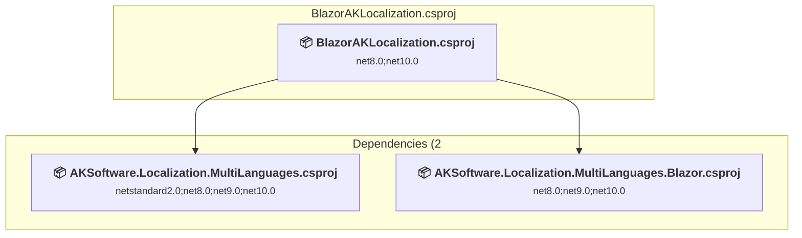

### API Compatibility

| Category | Count | Impact |
| :--- | :---: | :--- |
| 🔴 Binary Incompatible | 0 | High - Require code changes |
| 🟡 Source Incompatible | 0 | Medium - Needs re-compilation and potential conflicting API error fixing |
| 🔵 Behavioral change | 3 | Low - Behavioral changes that may require testing at runtime |
| ✅ Compatible | 801 |  |
| ***Total APIs Analyzed*** | ***804*** |  |

### BlazorServerLocalizationSample\BlazorServerLocalizationSample.csproj

#### Project Info

- **Current Target Framework:** net8.0;net10.0
- **Proposed Target Framework:** net8.0;net10.0;net10.0
- **SDK-style**: True
- **Project Kind:** AspNetCore
- **Dependencies**: 1
- **Dependants**: 0
- **Number of Files**: 50
- **Number of Files with Incidents**: 2
- **Lines of Code**: 178
- **Estimated LOC to modify**: 1+ (at least 0.6% of the project)

#### Dependency Graph

Legend:
📦 SDK-style project
⚙️ Classic project

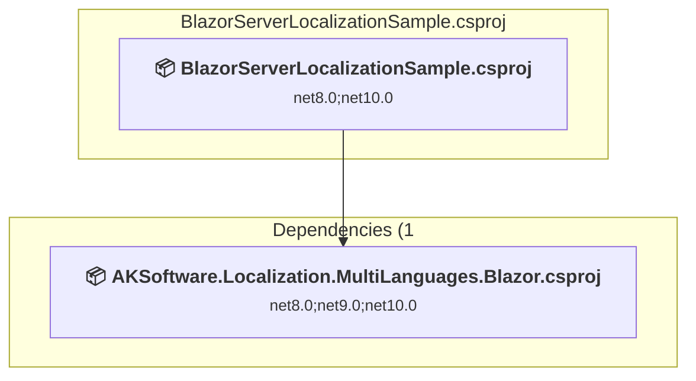

### API Compatibility

| Category | Count | Impact |
| :--- | :---: | :--- |
| 🔴 Binary Incompatible | 0 | High - Require code changes |
| 🟡 Source Incompatible | 0 | Medium - Needs re-compilation and potential conflicting API error fixing |
| 🔵 Behavioral change | 1 | Low - Behavioral changes that may require testing at runtime |
| ✅ Compatible | 1780 |  |
| ***Total APIs Analyzed*** | ***1781*** |  |

### BlazorWebApp.Sample\BlazorWebApp.Sample.csproj

#### Project Info

- **Current Target Framework:** net9.0;net10.0
- **Proposed Target Framework:** net9.0;net10.0;net10.0
- **SDK-style**: True
- **Project Kind:** AspNetCore
- **Dependencies**: 0
- **Dependants**: 0
- **Number of Files**: 17
- **Number of Files with Incidents**: 2
- **Lines of Code**: 57
- **Estimated LOC to modify**: 1+ (at least 1.8% of the project)

#### Dependency Graph

Legend:
📦 SDK-style project
⚙️ Classic project

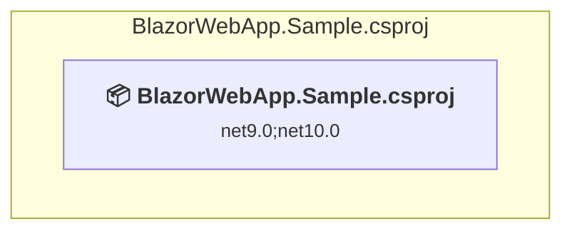

### API Compatibility

| Category | Count | Impact |
| :--- | :---: | :--- |
| 🔴 Binary Incompatible | 0 | High - Require code changes |
| 🟡 Source Incompatible | 0 | Medium - Needs re-compilation and potential conflicting API error fixing |
| 🔵 Behavioral change | 1 | Low - Behavioral changes that may require testing at runtime |
| ✅ Compatible | 656 |  |
| ***Total APIs Analyzed*** | ***657*** |  |

### ConsoleAppSample\ConsoleAppSample.csproj

#### Project Info

- **Current Target Framework:** net7.0;net10.0
- **Proposed Target Framework:** net7.0;net10.0;net10.0
- **SDK-style**: True
- **Project Kind:** DotNetCoreApp
- **Dependencies**: 1
- **Dependants**: 0
- **Number of Files**: 21
- **Number of Files with Incidents**: 1
- **Lines of Code**: 9
- **Estimated LOC to modify**: 0+ (at least 0.0% of the project)

#### Dependency Graph

Legend:
📦 SDK-style project
⚙️ Classic project

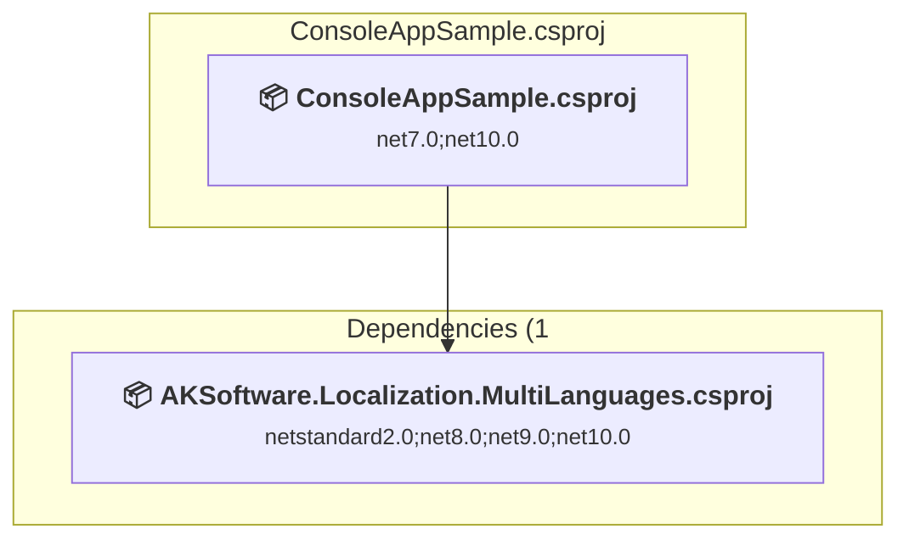

### API Compatibility

| Category | Count | Impact |
| :--- | :---: | :--- |
| 🔴 Binary Incompatible | 0 | High - Require code changes |
| 🟡 Source Incompatible | 0 | Medium - Needs re-compilation and potential conflicting API error fixing |
| 🔵 Behavioral change | 0 | Low - Behavioral changes that may require testing at runtime |
| ✅ Compatible | 5 |  |
| ***Total APIs Analyzed*** | ***5*** |  |

### D:\dev\GitHub\multilanguages\tests\AKSoftware.Localization.MultiLanguages.UWP.Tests\AKSoftware.Localization.MultiLanguages.UWP.Tests.csproj

#### Project Info

- **Current Target Framework:** net5.0
- **Proposed Target Framework:** net10.0-windows10.0.22000.0
- **SDK-style**: False
- **Project Kind:** Uwp
- **Dependencies**: 2
- **Dependants**: 0
- **Number of Files**: 26
- **Number of Files with Incidents**: 1
- **Lines of Code**: 279
- **Estimated LOC to modify**: 0+ (at least 0.0% of the project)

#### Dependency Graph

Legend:
📦 SDK-style project
⚙️ Classic project

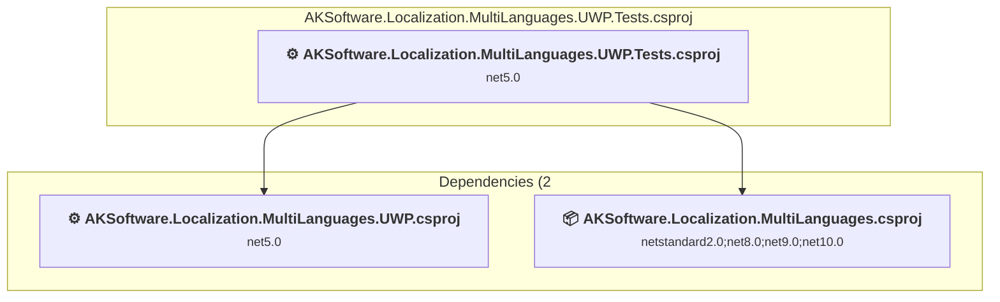

### API Compatibility

| Category | Count | Impact |
| :--- | :---: | :--- |
| 🔴 Binary Incompatible | 0 | High - Require code changes |
| 🟡 Source Incompatible | 0 | Medium - Needs re-compilation and potential conflicting API error fixing |
| 🔵 Behavioral change | 0 | Low - Behavioral changes that may require testing at runtime |
| ✅ Compatible | 256 |  |
| ***Total APIs Analyzed*** | ***256*** |  |

#### Project Package References

| Package | Type | Current Version | Suggested Version | Description |
| :--- | :---: | :---: | :---: | :--- |
| Microsoft.NET.Test.Sdk | 🔗*Transitive* | 16.11.0 |  | ✅Compatible |
| Microsoft.NETCore.UniversalWindowsPlatform | Explicit | 6.2.10 |  | ✅Compatible |
| MSTest.TestAdapter | Explicit | 2.0.0 |  | ✅Compatible |
| MSTest.TestFramework | Explicit | 2.0.0 |  | ✅Compatible |

### UwpAkLocalization\UwpAkLocalization.csproj

#### Project Info

- **Current Target Framework:** net5.0
- **Proposed Target Framework:** net10.0-windows10.0.22000.0
- **SDK-style**: False
- **Project Kind:** Uwp
- **Dependencies**: 2
- **Dependants**: 0
- **Number of Files**: 32
- **Number of Files with Incidents**: 2
- **Lines of Code**: 259
- **Estimated LOC to modify**: 2+ (at least 0.8% of the project)

#### Dependency Graph

Legend:
📦 SDK-style project
⚙️ Classic project

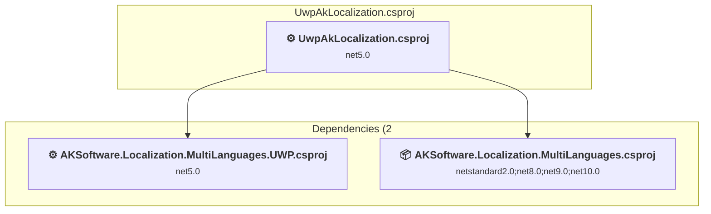

### API Compatibility

| Category | Count | Impact |
| :--- | :---: | :--- |
| 🔴 Binary Incompatible | 0 | High - Require code changes |
| 🟡 Source Incompatible | 0 | Medium - Needs re-compilation and potential conflicting API error fixing |
| 🔵 Behavioral change | 2 | Low - Behavioral changes that may require testing at runtime |
| ✅ Compatible | 281 |  |
| ***Total APIs Analyzed*** | ***283*** |  |

### WinUIAkLocalization\WinUIAkLocalization.csproj

#### Project Info

- **Current Target Framework:** net8.0-windows10.0.19041.0;net10.0-windows10.0.19041.0
- **Proposed Target Framework:** net8.0-windows10.0.19041.0;net10.0-windows10.0.19041.0;net10.0-windows10.0.22000.0
- **SDK-style**: True
- **Project Kind:** WinForms
- **Dependencies**: 2
- **Dependants**: 0
- **Number of Files**: 46
- **Number of Files with Incidents**: 4
- **Lines of Code**: 275
- **Estimated LOC to modify**: 6+ (at least 2.2% of the project)

#### Dependency Graph

Legend:
📦 SDK-style project
⚙️ Classic project

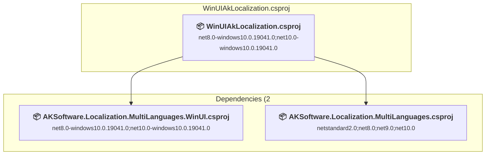

### API Compatibility

| Category | Count | Impact |
| :--- | :---: | :--- |
| 🔴 Binary Incompatible | 0 | High - Require code changes |
| 🟡 Source Incompatible | 0 | Medium - Needs re-compilation and potential conflicting API error fixing |
| 🔵 Behavioral change | 6 | Low - Behavioral changes that may require testing at runtime |
| ✅ Compatible | 1392 |  |
| ***Total APIs Analyzed*** | ***1398*** |  |

